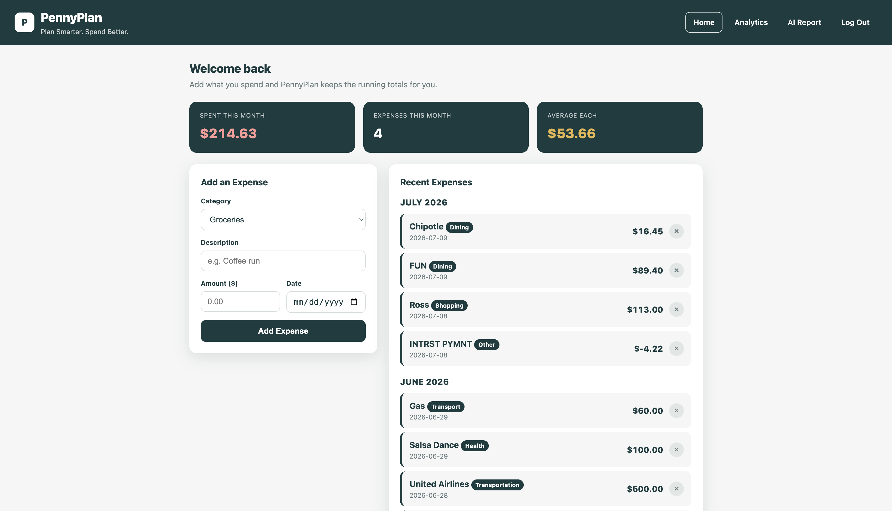
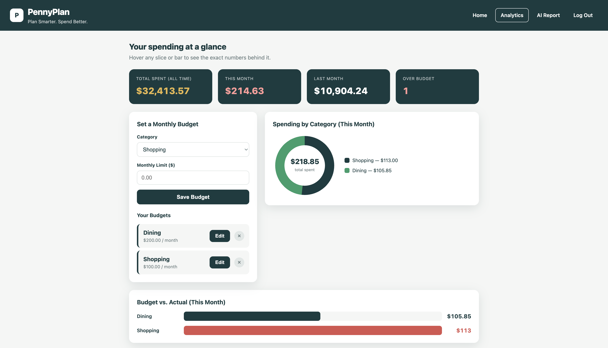
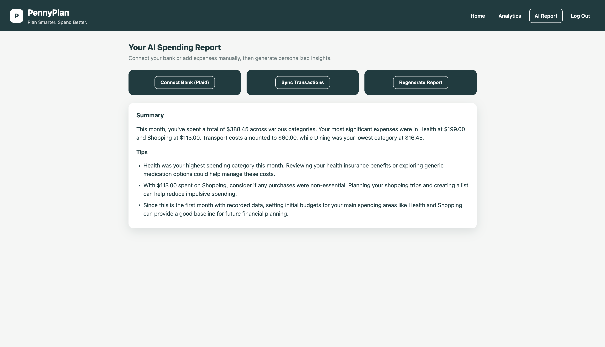

# 💰PennyPlan

PennyPlan is an AI-powered personal budgeting application that helps users track expenses, create personalized budgets, and gain actionable insights into their spending habits. By combining manual expense tracking, automated bank transaction imports through Plaid, and AI-generated financial reports, PennyPlan empowers users to make smarter financial decisions and stay on track toward their financial goals.

## Features

- Create a secure user account and log in using Supabase Authentication 
- Manually track and manage daily expenses
- Create and update monthly budgets by spending category
- Compare budgeted amounts against actual spending
- Generate AI-powered spending reports and personalized financial insights
- Visualize spending trends through an interactive dashboard
- Automatically import bank transactions using Plaid integration

## How To Use

### User Input

### Expense Visualization

### Spending Report & Budgeting Tips

---

## Technologies Used

- Python 3
- Flask 
- [Supabase (Database & Authentication)](https://supabase.com)
- [Plaid API](https://plaid.com)
- [Google Gemini API](https://ai.google.dev/gemini-api/docs)
- HTML
- CSS
- React
- JavaScript

---
## Contact

For questions, suggestions, or collaborative opportunities, please contact:

### Eva King-Senior
- Email: [evakingsr@gmail.com](mailto:evakingsr@gmail.com)
- GitHub : [evakingsr](https://github.com/evakingsr)

### Shellsea Nunez-Aviles
- Email: [shenunavi126@gmail.com](mailto:shenunavi126@gmail.com)
- GitHub : [aesheeds](https://github.com/aesheeds)

### Charles Mada
- Email: [c5mada2005@gmail.com](mailto:c5mada2005@gmail.com)
- GitHub : [bananaeater9000](https://github.com/bananaeater9000)